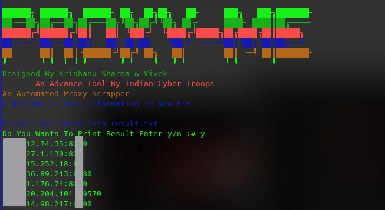

# PROXY-ME
proxy-me is a tool to grab or scrape proxies across internet under specific protocols,
It is a lightweight project that hourly scrapes lots of free-proxy, 
FREE proxies. Supported platforms: Windows, Linux, MacOS, Termux
This Is is Tool For Checkout Status Of Urls in Mass Its For Bug Bounty Hunters And Black Hat Hackers It Will Save Your Valuable Time  Script is Designed By Indian Cyber Troops

## Designed By : Krishanu Sharma | Vivek
<p>
 <a href="https://www.youtube.com/c/indiancybertroops">
    
  </a>
    <a href="https://instagram.com/indiancybertroops">
    
  </a>
     <a href="https://t.me/indiancybertroops">
    
  </a>

</p>
   
   


### Team Indian Cyber Troops:
>Created By : Indian Cyber Troops

# Features:
>Easy to Install

>Easy to Use

>Designed In Bash(shell scripting)

>Easy To Execue

>Fastest 

>No Bandwith/Data Consume

>To Check Mass Url Status Code

# Main Proxy-me Image

# Installation :
> clone via git clone

```
git clone https://github.com/indiancybertroops/proxy-me
```
```
cd proxy-me
```
```
chmod +777 *
```
```
sudo bash proxy-me.sh
```


# Github Status
[](https://github.com/indiancybertroops "Stats")<br>

## Contact Us: 


>Instagram
https://instagram.com/krishanuIND
>Instagram
https://instagram.com/Indiancybertroops


>Twitter
https://twitter.com/krishanuIND


>Github
https://github.com/indiancybertroops

## WARNING : 
***This tool is only for educational purpose. If you use this tool for other purposes except education we will not be responsible in such cases. We Are Not Responsible For Damage Caused By Tool***

[!] legal disclaimer: Usage of Usage of Proxy-me for attacking targets without prior mutual consent is illegal. It is the end user's responsibility to obey all applicable local, state and federal laws. Developers assume no liability and are not responsible for any misuse or damage caused by this program
